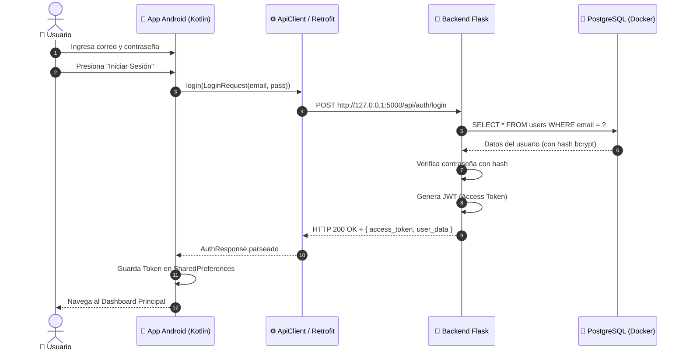

# 📘 Guía Completa de Exposición y Arquitectura — PlomApp

> **Proyecto:** PlomApp (Aplicación Móvil de Plomería y Mantenimiento)  
> **Arquitectura:** Cliente - Servidor (3 Capas) con API REST  
> **Fecha:** 2026

---

## 📑 Tabla de Contenidos
1. [Resumen Ejecutivo](#1-resumen-ejecutivo)
2. [Arquitectura del Sistema (3 Capas)](#2-arquitectura-del-sistema-3-capas)
3. [Stack Tecnológico](#3-stack-tecnológico)
4. [Mecanismos de Conectividad (Celular ↔ Backend)](#4-mecanismos-de-conectividad-celular--backend)
5. [Análisis del Código Clave (Línea por Línea)](#5-análisis-del-código-clave-línea-por-línea)
   - [ApiClient.kt (Gestor de Red y Fallback)](#apiclientkt-gestor-de-red-y-fallback)
   - [ApiService.kt (Catálogo de Endpoints)](#apiservicekt-catálogo-de-endpoints)
6. [Flujo de Ejecución Paso a Paso (Login y Servicios)](#6-flujo-de-ejecución-paso-a-paso)
7. [Seguridad y Buenas Prácticas](#7-seguridad-y-buenas-prácticas)
8. [Preguntas Típicas del Jurado y Cómo Responderlas](#8-preguntas-típicas-del-jurado-y-cómo-responderlas)

---

## 1. Resumen Ejecutivo

**PlomApp** es una solución integral diseñada para conectar clientes residenciales o comerciales con técnicos especializados en servicios de plomería, mantenimiento, detección de fugas e instalaciones.

El sistema se compone de:
- Una **Aplicación Móvil Android Nativa** orientada al usuario final y al técnico.
- Un **Backend REST API** que gestiona la lógica de negocio, autenticación y agendamiento.
- Una **Base de Datos Relacional** para persistir la información de manera segura y escalable.

---

## 2. Arquitectura del Sistema (3 Capas)

El proyecto implementa el patrón **Cliente - Servidor**:

```
+-------------------------------------------------------------+
|                CAPA 1: PRESENTACIÓN (MÓVIL)                |
|  Android Nativo (Kotlin / Jetpack Compose / Material 3)     |
+-------------------------------------------------------------+
                              │ ▲
             Peticiones HTTP  │ │  Respuestas JSON
            (Retrofit/OkHttp) │ │  (Status codes: 200, 401, 500)
                              ▼ │
+-------------------------------------------------------------+
|                 CAPA 2: LÓGICA DE NEGOCIO                   |
|       Backend REST API en Python (Flask Framework)          |
|  - Auth JWT       - Gestión de Servicios    - Endpoints     |
+-------------------------------------------------------------+
                              │ ▲
              Consultas SQL   │ │  Resultados de Tablas
              (SQLAlchemy)    │ │
                              ▼ │
+-------------------------------------------------------------+
|                   CAPA 3: DATOS (PERSISTENCIA)              |
|        PostgreSQL Database (Ejecutándose en Docker)         |
+-------------------------------------------------------------+
```

---

## 3. Stack Tecnológico

| Componente | Tecnología | Rol en el Proyecto |
| :--- | :--- | :--- |
| **Frontend Móvil** | **Kotlin (Android Nativo)** | Interfaz gráfica fluida, reactiva y optimizada para dispositivos Android. |
| **Red Móvil** | **Retrofit 2 + OkHttp 3** | Cliente HTTP asíncrono para consumir la API REST y serializar JSON con Gson. |
| **Backend API** | **Python (Flask)** | Procesamiento de peticiones, endpoints REST y autenticación de usuarios. |
| **Base de Datos** | **PostgreSQL** | Motor de base de datos relacional robusto con soporte transaccional ACID. |
| **Contenedores** | **Docker** | Entorno estandarizado y aislado para levantar la base de datos PostgreSQL. |
| **Seguridad** | **JWT (JSON Web Tokens)** | Manejo de sesiones sin estado (Stateless) mediante tokens firmados criptográficamente. |

---

## 4. Mecanismos de Conectividad (Celular ↔ Backend)

Para conectar el dispositivo físico con el servidor local durante el desarrollo y demostración, el proyecto cuenta con **dos mecanismos**:

```
                  ┌────────────────────────────────────────┐
                  │          Dispositivo Android           │
                  └──────────────────┬─────────────────────┘
                                     │
                 ┌───────────────────┴───────────────────┐
                 │                                       │
        [Opción 1: Cable USB]                   [Opción 2: Wi-Fi LAN]
      ADB Reverse (tcp:5000)                      IP LAN (10.1.193.174)
                 │                                       │
                 └───────────────────┬───────────────────┘
                                     ▼
                  ┌────────────────────────────────────────┐
                  │         Servidor Flask (PC)            │
                  │            Puerto: 5000                │
                  └────────────────────────────────────────┘
```

1. **Túnel USB (`adb reverse tcp:5000 tcp:5000`):**
   - El teléfono realiza peticiones a `http://127.0.0.1:5000`.
   - Android Debug Bridge (ADB) redirige los paquetes a través del cable USB al puerto 5000 de la PC.
   - **Ventaja:** Cero latencia, no depende de la calidad de la señal Wi-Fi.

2. **Red de Área Local Wi-Fi (`http://10.1.193.174:5000`):**
   - El celular y la PC están conectados a la misma red Wi-Fi.
   - Si el túnel USB se desconecta, el cliente activa el **mecanismo de fallback** automático hacia la IP de la PC en la red.

---

## 5. Análisis del Código Clave (Línea por Línea)

### `ApiClient.kt` (Gestor de Red y Fallback)
**Ubicación:** `app/src/main/java/com/example/plomaap/data/api/ApiClient.kt`

```kotlin
package com.example.plomaap.data.api

import okhttp3.Interceptor
import okhttp3.OkHttpClient
import okhttp3.logging.HttpLoggingInterceptor
import retrofit2.Retrofit
import retrofit2.converter.gson.GsonConverterFactory
import java.io.IOException
import java.util.concurrent.TimeUnit

object ApiClient {
    private const val PRIMARY_HOST = "127.0.0.1"       // 1. Host primario (USB ADB reverse)
    private const val WIFI_HOST = "10.1.193.174"      // 2. Host de respaldo por Wi-Fi
    private const val EMULATOR_HOST = "10.0.2.2"       // 3. Host de respaldo para Emulador
    private const val PORT = 5000

    const val BASE_URL = "http://$PRIMARY_HOST:$PORT/"

    // Interceptor con patrón de Resiliencia (Fallback)
    private val fallbackInterceptor = Interceptor { chain ->
        val originalRequest = chain.request()
        try {
            chain.proceed(originalRequest)             // Intento 1: USB (127.0.0.1)
        } catch (e: IOException) {
            // Fallback 1: Si falla el cable, cambia la URL a la IP Wi-Fi
            val url = originalRequest.url
            val newUrlWifi = url.newBuilder().host(WIFI_HOST).build()
            val newRequestWifi = originalRequest.newBuilder().url(newUrlWifi).build()
            try {
                chain.proceed(newRequestWifi)          // Intento 2: Wi-Fi LAN
            } catch (e2: IOException) {
                // Fallback 2: Si falla Wi-Fi, prueba con la IP del Emulador
                val newUrlEmu = url.newBuilder().host(EMULATOR_HOST).build()
                val newRequestEmu = originalRequest.newBuilder().url(newUrlEmu).build()
                chain.proceed(newRequestEmu)          // Intento 3: Emulador
            }
        }
    }

    private val loggingInterceptor = HttpLoggingInterceptor().apply {
        level = HttpLoggingInterceptor.Level.BODY     // Muestra peticiones y respuestas en Logcat
    }

    private val okHttpClient = OkHttpClient.Builder()
        .addInterceptor(fallbackInterceptor)          // Agrega la tolerancia a fallos
        .addInterceptor(loggingInterceptor)           // Agrega el logger
        .connectTimeout(5, TimeUnit.SECONDS)          // Timeout de conexión rápido para conmutar
        .readTimeout(15, TimeUnit.SECONDS)
        .writeTimeout(15, TimeUnit.SECONDS)
        .build()

    private val retrofit: Retrofit = Retrofit.Builder()
        .baseUrl(BASE_URL)
        .client(okHttpClient)
        .addConverterFactory(GsonConverterFactory.create()) // Convierte JSON a objetos Kotlin
        .build()

    val apiService: ApiService = retrofit.create(ApiService::class.java)
}
```

---

### `ApiService.kt` (Catálogo de Endpoints)
**Ubicación:** `app/src/main/java/com/example/plomaap/data/api/ApiService.kt`

```kotlin
interface ApiService {
    // 1. Autenticación tradicional
    @POST("api/auth/login")
    suspend fun login(@Body request: LoginRequest): Response<AuthResponse>

    // 2. Registro de nuevos usuarios
    @POST("api/auth/register")
    suspend fun register(@Body request: RegisterRequest): Response<AuthResponse>

    // 3. Catálogo de servicios disponibles
    @GET("api/services")
    suspend fun getServices(
        @Query("limit") limit: Int = 50,
        @Query("search") search: String = "",
        @Query("category") category: String = ""
    ): Response<ServicesResponse>

    // 4. Creación de una cita / solicitud de servicio
    @POST("api/appointments")
    suspend fun createAppointment(
        @Header("Authorization") token: String,
        @Body request: CreateAppointmentRequest
    ): Response<CreateAppointmentResponse>
}
```

* **`suspend fun`:** Ejecución en hilos secundarios mediante *Kotlin Coroutines*, garantizando que la interfaz del usuario permanezca fluida (60/120 FPS).
* **`@Header("Authorization")`:** Envío del Token Bearer JWT para validar permisos en endpoints protegidos.

---

## 6. Flujo de Ejecución Paso a Paso

### Caso de Uso: Inicio de Sesión (Login)



---

## 7. Seguridad y Buenas Prácticas

1. **Protección de Credenciales:** Las contraseñas nunca se almacenan en texto plano en la base de datos; se utiliza hash criptográfico (bcrypt/argon2).
2. **Tokens JWT:** Las peticiones autenticadas viajan con una cabecera `Authorization: Bearer <token>`, evitando almacenar credenciales en el cliente móvil.
3. **Control de Errores y Timeouts:** Conexiones con timeouts explícitos (5s) para evitar bloqueos por desconexión de red.
4. **Permisos Android:** Uso explícito de `android.permission.INTERNET` y `android.permission.ACCESS_NETWORK_STATE` en el `AndroidManifest.xml`.

---

## 8. Preguntas Típicas del Jurado y Cómo Responderlas

#### P1: ¿Por qué eligieron una arquitectura Cliente-Servidor desacoplada en lugar de una app monolítica?
> **Respuesta:** "Porque permite separar responsabilidades: el frontend en Android se enfoca exclusivamente en brindar una excelente experiencia de usuario (UX/UI), mientras que el backend centraliza la seguridad, validaciones de negocio y acceso a datos. Además, esta misma API REST puede ser consumida en el futuro por una aplicación web u otros clientes sin duplicar código de negocio."

#### P2: ¿Cómo maneja la app los problemas de conectividad o caídas del servidor?
> **Respuesta:** "Implementamos un patrón de resiliencia mediante un `fallbackInterceptor` en OkHttp. La aplicación intenta primero la conexión más rápida (túnel USB por ADB). Si no hay respuesta o falla el socket, conmuta automáticamente a la red Wi-Fi y finalmente a la configuración de emulador, evitando cierres inesperados (*crashes*)."

#### P3: ¿Cómo viaja la información entre el celular y el servidor?
> **Respuesta:** "La comunicación es completamente asíncrona mediante el protocolo HTTP/1.1 usando llamadas REST. Los datos se serializan y deserializan automáticamente en formato JSON gracias a la biblioteca Retrofit con Gson Converter."
